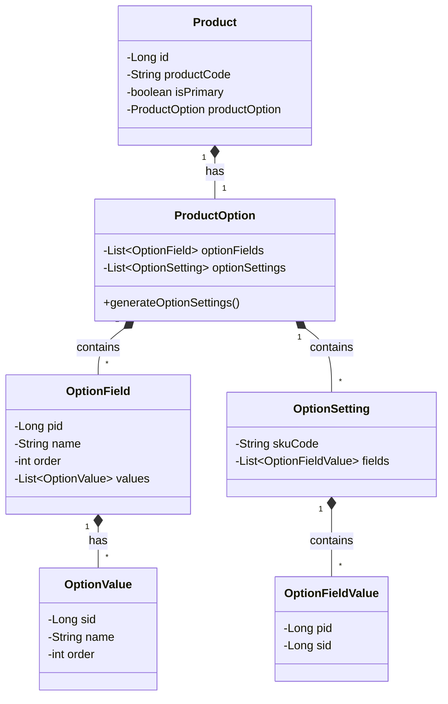

# product-option-field-demo

This project demonstrates a flexible product option system designed to handle various product configurations,
such as different sizes, colors, and materials.
The system is particularly useful for e-commerce applications where products can have multiple variants.

## Core Concepts

### Product Structure
- **Product**: The main entity representing a product (e.g., T-shirt)
    - Has a unique product code (e.g., "TSHIRT-001")
    - Contains product options

### Option Hierarchy
1. **ProductOption**: Container for all option fields and settings
2. **OptionField**: Represents a category of options (e.g., Size, Color)
    - Has a unique `pid` (Product ID)
    - Contains multiple option values
    - Has an order for display priority
3. **OptionValue**: Individual values within an option field (e.g., "Small", "Red")
    - Has a unique `sid` (Setting ID)
    - Has an order for display priority
4. **OptionSetting**: Represents a specific combination of options (SKU)
    - Contains the SKU code
    - Maps option fields to their selected values

## Class Diagram



## Example Structure

```json
{
  "optionFields": [
    {
      "pid": 100,
      "name": "Size",
      "order": 1,
      "values": [
        {
          "sid": 101,
          "name": "M",
          "order": 2
        },
        {
          "sid": 102,
          "name": "S",
          "order": 1
        },
        {
          "sid": 103,
          "name": "L",
          "order": 3
        }
      ]
    },
    {
      "pid": 200,
      "name": "Color",
      "order": 2,
      "values": [
        {
          "sid": 201,
          "name": "Blue",
          "order": 2
        },
        {
          "sid": 202,
          "name": "Red",
          "order": 1
        }
      ]
    }
  ]
}
```

### Option Settings Structure

```json
{
  "optionFields": [...],
  "optionSettings": [
    {
      "skuCode": "TSHIRT-001-S-RED",
      "fields": [
        {
          "pid": 100,
          "sid": 102
        },
        {
          "pid": 200,
          "sid": 202
        }
      ]
    },
    {
      "skuCode": "TSHIRT-001-M-BLUE",
      "fields": [
        {
          "pid": 100,
          "sid": 101
        },
        {
          "pid": 200,
          "sid": 201
        }
      ]
    }
  ]
}
```

In this structure:
- Each `optionSetting` represents a unique SKU combination
- `skuCode` is automatically generated from the product code and selected options
- `fields` contains the selected option values for this SKU, where:
    - `pid` (Product ID) references the OptionField (e.g., Size=100, Color=200)
    - `sid` (Setting ID) references the specific OptionValue (e.g., S=102, M=101)

## Features

1. **Hierarchical Structure**: Options are organized in a clear hierarchy (Product → Option Fields → Option Values)
2. **Ordered Display**: Both option fields and values support ordering for consistent display
3. **Unique Identifiers**: Each component has unique identifiers (pid, sid) for reliable referencing
4. **SKU Generation**: Automatic generation of all possible product variants (SKUs)
5. **JSON Serialization**: Built-in support for JSON formatting with pretty printing

## Usage Example

```java
    Product tshirt = Product.builder()
        .productCode("TSHIRT-001")
        .productOption(ProductOption.builder()
            .optionFields(Arrays.asList(
                OptionField.builder()
                    .pid(100L)
                    .name("Size")
                    .order(1)
                    .values(Arrays.asList(
                        OptionValue.builder()
                            .sid(101L)
                            .name("M")
                            .order(2)
                            .build()
                    ))
                    .build()
            ))
            .build())
        .build();
    
    // Generate all possible SKU combinations
    tshirt.generateOptionSettings();
```

## Tree View Output

The system can display the option structure in a tree format:
```
Product Option Tree:
├── Option Fields
├── Size (pid: 100)
│    ├── S (sid: 102, order: 1)
│    └── M (sid: 101, order: 2)
└── Color (pid: 200)
     ├── Red (sid: 202, order: 1)
     └── Blue (sid: 201, order: 2)
├── Option Settings
├── TSHIRT-001-100-102-200-202: 100: 102, 200: 202
├── TSHIRT-001-100-102-200-201: 100: 102, 200: 201
├── TSHIRT-001-100-101-200-202: 100: 101, 200: 202
└── TSHIRT-001-100-101-200-201: 100: 101, 200: 201
```

## Dependencies

- Java 11
- Lombok for reducing boilerplate code
- Gson for JSON serialization
- JUnit Jupiter for testing

## Getting Started

1. Clone the repository
2. Ensure you have Java 11 installed
3. Build the project using Maven:
   ```bash
   mvn clean install
   ```
4. Run the tests to see the option system in action:
   ```bash
   mvn test
   ```
